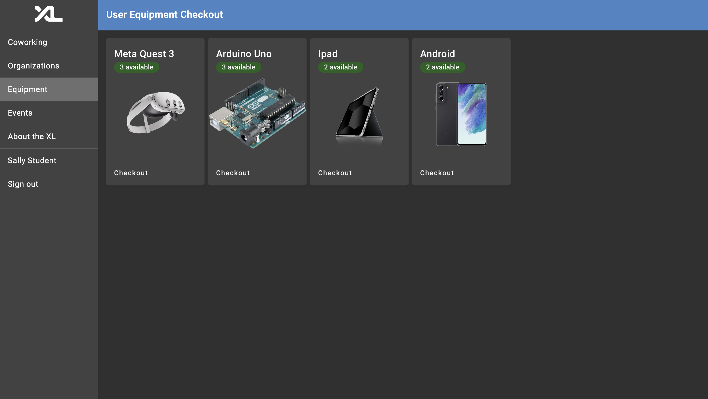
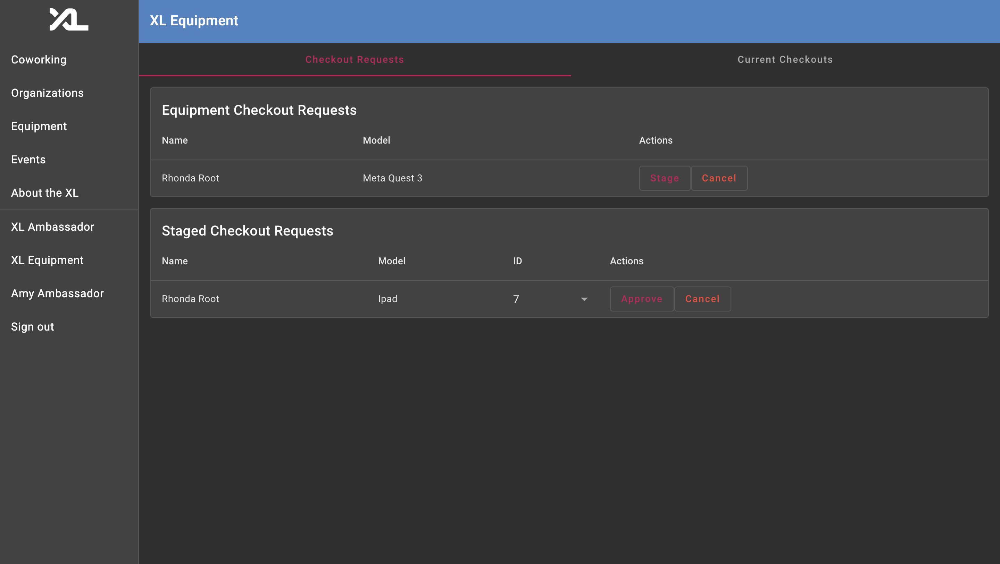
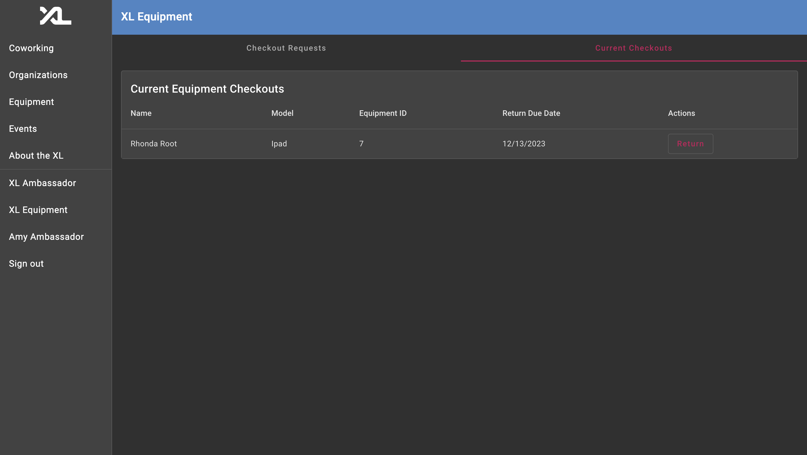

# Computer Science Experience Labs

The Experience Labs' (XL) mission is to accelerate technical experience and build community among undergraduate CS majors at The University of North Carolina at Chapel Hill. The XL's web app, found in production at `csxl.unc.edu`, is backed by this repository.

## Purpose

This project was built by various students that have been enrolled in UNC Chapel Hill's Comp 590 special topics cource, as well as kris jordan. While I was enrolled in this class, I worked alongside Ayden Franklin, Jacob Brown, and Nicholas Mountain to implement a feature of our choice. We implemented an equipment checkout system that allows students to check available equipment in and out of the CSXL. Once the CSXL has equipment available for students to reserve, a checkout system will be needed.
Our feature was implemented over the course of three, two week sprints. Each team members made significant contributions to the feature in both the frontend and backend of the project.  

## Tech Stack

The stack for this project uses Angular, Rxjs, and Angular Material UI for the Frontend. The project uses Fast API and SQL Alchemy for the backend. For the data layer, this project uses a Postgres SQL database. 

## Equipment Specific Documentation

* [Equipment Reservation Design Doc & Specs](docs/docs/equipment-reservation-system-design-doc-spec.md)
* [Equipment Reservation Wireframes and Planning](docs/docs/equipment-reservation-system-design-doc.md)

## Developer Docs

* [Get Started with a Development Environment](docs/get_started.md)
* [Authentication, Authorization, and Permissions](docs/auth.md)
* [Testing Tools](docs/testing.md)

## Feature Docs

* [Github Integration](docs/github_integration.md)

## Equipment Reservation System Images

